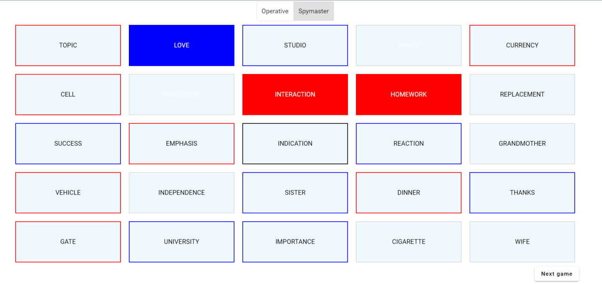

# Codenames
Creating the game "Codenames", using Angular 16, NodeJS, Socket.io, Express


# Frontend

This project was generated with [Angular CLI](https://github.com/angular/angular-cli) version 16.1.6.

## Development server

Run `ng serve` for a dev server. Navigate to `http://localhost:4200/`. The application will automatically reload if you change any of the source files.

## Code scaffolding

Run `ng generate component component-name` to generate a new component. You can also use `ng generate directive|pipe|service|class|guard|interface|enum|module`.

## Build

Run `ng build` to build the project. The build artifacts will be stored in the `dist/` directory.

# Backend
Run `nodemon` for a dev server.

# User Stories

```
1.
As a user, 
I want to be able to create a new game and obtain a unique game ID, 
So that I can share it with my friends to invite them to join the game.
```
```
2.
As a player, 
I want to be able to choose a role (operative or spymaster) after starting the game, 
So that I can actively participate in the game according to my preferred role.
```
```
3.
As an operative role player, 
I want to see a list of words relevant to my role during the game, 
So that I can interact with them by clicking on them to mark them as chosen.
```
```
4.
As a spymaster role player, 
I want to view a list of all words in the game along with color-coded borders indicating their affiliations,
So that I can strategize and provide clues to my team without interacting with the words directly.
```
```
5.
As a user, 
I want the option to continue playing with a new game after finishing the current one, 
So that I can enjoy multiple rounds of the game without interruption.
```
```
6.
As a player, 
I want to receive real-time updates from the server, including information about joined players, game start, and ongoing game updates, 
So that I stay informed about the game's progress.
```


